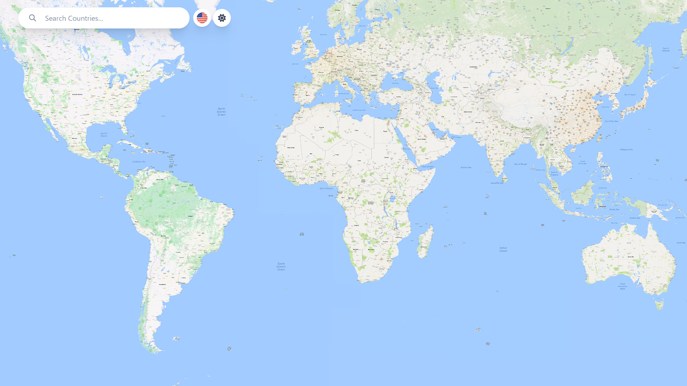
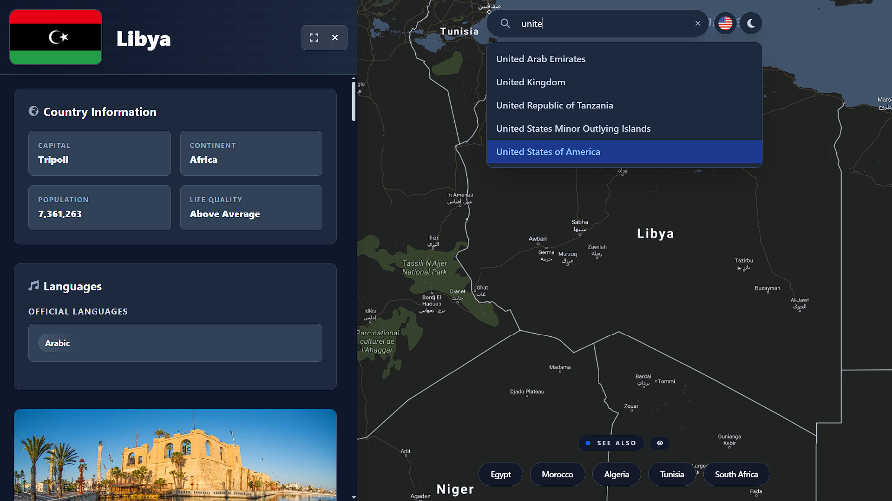
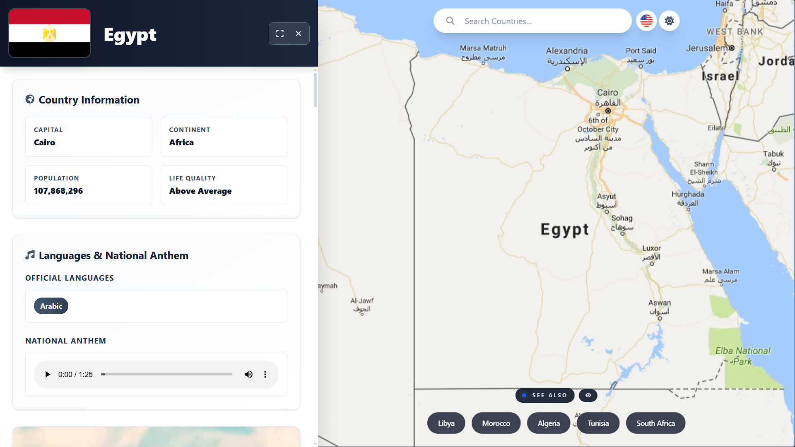
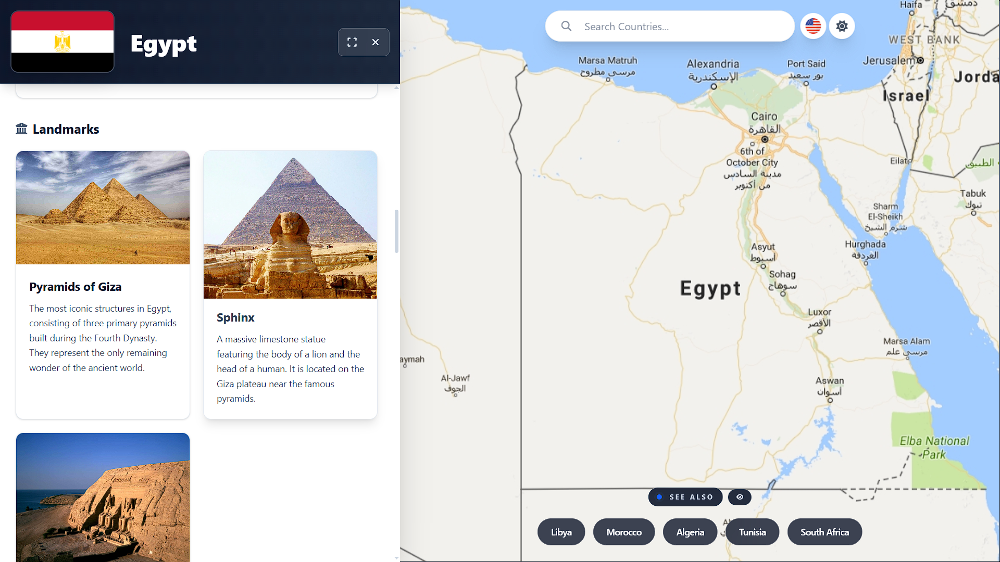
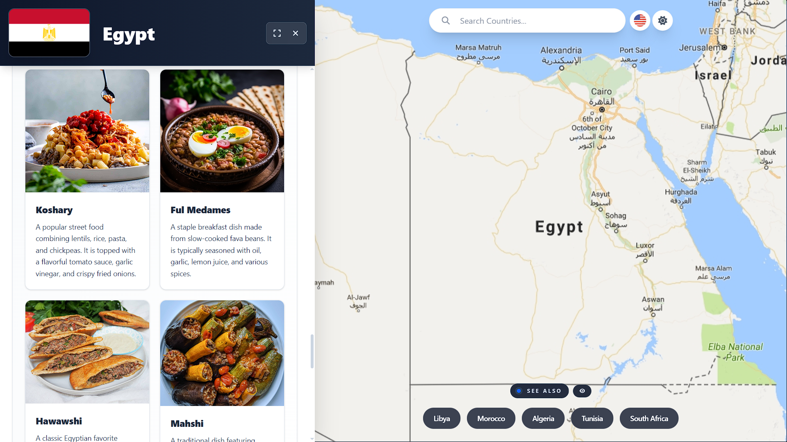
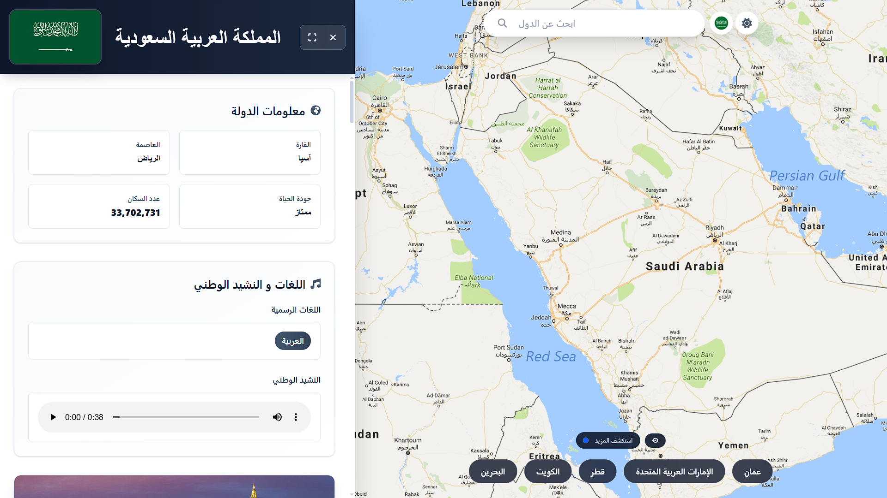
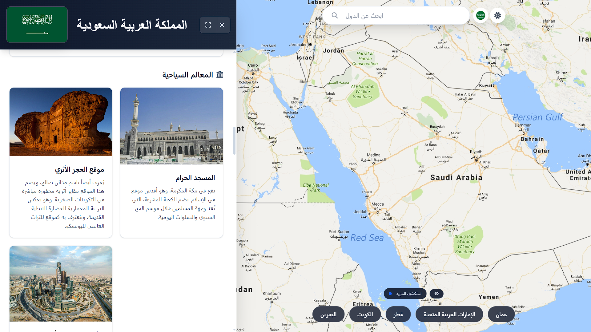
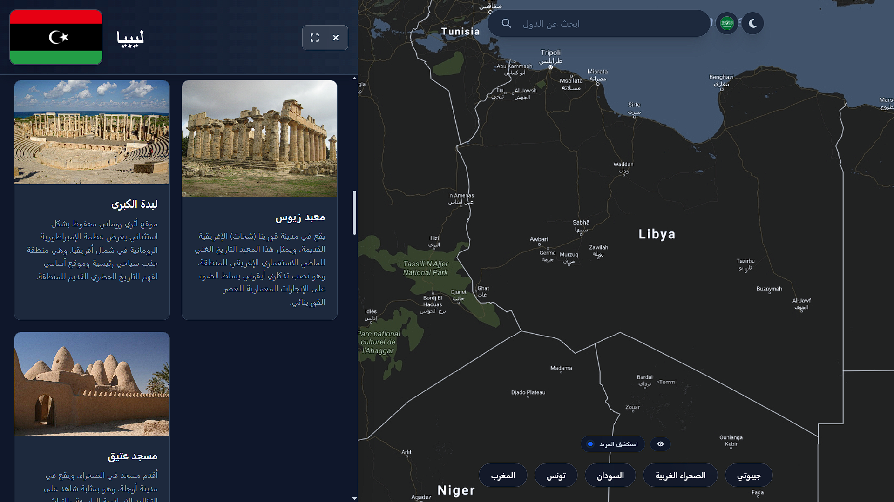

# 🗺️ AOM Maps

(اللغة العربية بالأسفل)
> **Live Deployment:** [aom-maps.netlify.app](https://aom-maps.netlify.app)



Welcome to **AOM Maps** — easily one of the most complex, challenging, and coolest projects we have ever been a part of.

If you have ever tried to look up a simple fact about a country and found yourself drowning in endless paragraphs of unnecessary jargon, AOM Maps is for you. It acts as a curated, noise-free mini-Wikipedia. No scrolling through massive walls of text — just the clear, summarized data that actually matters.

---

## The Experience

AOM Maps is designed to be **beautiful**, **highly responsive on mobile devices**, and **incredibly intuitive**. Simply click or tap on any country on the interactive map, or use the search bar, to instantly view:

| Category | Details |
|---|---|
| General | Summaries and historical highlights |
| Geography | Population, continent, capital & major cities |
| Politics | Presidents, political & economic status |
| Economy | Quality of life and currencies |
| Culture | Languages, cuisine, and most significant dishes |
| Lifestyle | Top landmarks, entertainment, and sports |
| Identity | National flags and anthems |

The application fully supports both **English** and **Arabic**, and features a sleek **Dark Mode** for comfortable viewing at any time of day.









---

## Under the Hood *(For Tech Enthusiasts)*

While the user interface is minimal and clean, the architecture powering it is a powerhouse of modern web technologies and clever data pipelines.

### Tech Stack

| Layer | Technology |
|---|---|
| **Frontend** | React, TypeScript |
| **Backend** | .NET 10, Entity Framework (EF) Core |
| **Database** | SQL Server |
| **Hosting** | Netlify (Frontend) · MonsterASP (Backend) |


---

### Interactive Mapping & Algorithms

To deliver an incredibly crisp visual experience, the app uses a massive **16k resolution** world map. We integrated **OpenSeadragon** with image tiling to ensure lightning-fast, smooth rendering and deep zooming without any performance drops.

Beneath this visual layer, instead of relying on heavy third-party map rendering libraries, the country detection is **built from the ground up**:

- Processes raw **GeoJSON** geographical data
- Translates coordinates into interactive screen pixels using **custom coordinate-to-pixel math functions**
- Uses **Bounding Boxes**, **Focus Bounding Boxes**, and **Ray Casting algorithms** for precise touch and click detection on complex country borders


---

### The Data Pipeline

To gather and clean the massive amount of global data, a highly automated pipeline was created:

```
Wikipedia  ──►  r.jina.ai  ──►  Gemini AI  ──►  SQL Server Database
(raw data)     (markdown)    (structured)       (production-ready)
```

1. **Extraction** — Raw data was sourced from Wikipedia and converted into clean Markdown using [r.jina.ai](https://r.jina.ai).
2. **AI Structuring** — The Markdown was fed into Gemini with highly specific custom prompts to strip out the noise, summarize the context, and extract only the exact fields required for the database.
3. **Media** — National flags and anthems were parsed from Wikipedia, while DuckDuckGo's search engine was used to systematically source and store image links for each country.


---

## Local Development & Build Steps

Want to run AOM Maps locally? Here is how to get started.

### Prerequisites

- [Node.js](https://nodejs.org/)
- [.NET 10 SDK](https://dotnet.microsoft.com/)
- [SQL Server](https://www.microsoft.com/en-us/sql-server)

---

### 1. Clone the Repository

```bash
git clone https://github.com/AbdoShalaby1/AOM-Maps
cd AOM-Maps
```

### 2. Database & Backend Setup (.NET 10)

Navigate to the backend directory and update `appsettings.json` with your local SQL Server connection string.

```bash
cd Backend

# Apply Entity Framework Core migrations to set up the schema
dotnet ef database update

# Run the .NET API
dotnet run
```

### 3. Frontend Setup (React + TypeScript)

Open a new terminal window and navigate to the frontend directory.

```bash
cd Frontend

# Install dependencies
npm install

# Start the development server
npm run dev
```

> The app will now be running locally. Make sure the frontend environment variables (like the API base URL) are pointing to your local .NET server port.

---

---

<div dir="rtl">

# 🗺️ خرائط AOM

> **رابط النسخة الحية:** [aom-maps.netlify.app](https://aom-maps.netlify.app)


مرحباً بكم في **خرائط AOM** — يُعد هذا المشروع بلا شك واحداً من أعقد وأروع المشاريع التي شاركنا فيها على الإطلاق.

إذا حاولت يوماً البحث عن معلومة بسيطة عن دولة ما ووجدت نفسك تغرق في فقرات لا نهاية لها من المصطلحات المعقدة، فإن **خرائط AOM** هو الحل. يعمل التطبيق كموسوعة مصغرة ومنقحة خالية من الحشو. لا داعي للتمرير عبر نصوص ضخمة — فقط البيانات الملخصة والواضحة التي تهمك حقاً.

---

## تجربة المستخدم

تم تصميم خرائط AOM ليكون **جميلاً**، و**متجاوباً بالكامل مع الهواتف المحمولة**، و**بديهياً للغاية**. ببساطة، انقر أو المس أي دولة على الخريطة التفاعلية، أو استخدم شريط البحث، لترى فوراً:

| الفئة | التفاصيل |
|---|---|
| عام | ملخصات وأبرز المحطات التاريخية |
| جغرافيا | عدد السكان، القارة، العاصمة، والمدن الكبرى |
| سياسة | الرؤساء، الوضع السياسي والاقتصادي |
| اقتصاد | جودة الحياة والعملات |
| ثقافة | اللغات، المطبخ، وأشهر الأطباق |
| أسلوب حياة | أبرز المعالم، الترفيه، والرياضة |
| هوية | الأعلام الوطنية والأناشيد |

يدعم التطبيق **العربية** و**الإنجليزية** بشكل كامل، ويحتوي على **الوضع الداكن** الأنيق لتجربة تصفح مريحة في أي وقت.


---

## ما وراء الكواليس *(للمهتمين بالتكنولوجيا)*

بينما تبدو واجهة المستخدم بسيطة ونظيفة، فإن البنية التحتية التي تشغلها تعتمد على تقنيات ويب حديثة ومسارات بيانات ذكية جداً.

### التقنيات المستخدمة

| الطبقة | التقنية |
|---|---|
| **الواجهة الأمامية** | React، TypeScript |
| **الخلفية** | .NET 10، Entity Framework (EF) Core |
| **قاعدة البيانات** | SQL Server |
| **الاستضافة** | Netlify للواجهة الأمامية · MonsterASP للخلفية |

---

### الخرائط التفاعلية والخوارزميات

لتقديم تجربة بصرية فائقة الدقة، يستخدم التطبيق خريطة عالمية بدقة **16K** هائلة. قمنا بدمج مكتبة **OpenSeadragon** مع تقنية تجزئة الصور لضمان عرض وتقريب سريع وسلس دون أي انخفاض في الأداء.

وتحت هذه الطبقة البصرية، وبدلاً من الاعتماد على مكتبات خارجية ثقيلة، تم بناء نظام اكتشاف الدول **من الصفر**:

- يعالج بيانات **GeoJSON** الجغرافية الخام
- يحولها إلى بكسلات شاشة تفاعلية باستخدام **دوال رياضية مخصصة لتحويل الإحداثيات**
- يستخدم **مربعات الإحاطة**، و**مربعات الإحاطة المركزة**، و**خوارزمية إسقاط الأشعة** لدقة اللمس والنقر على حدود الدول المعقدة

---

### مسار البيانات

لجمع وتنظيف هذا الكم الهائل من البيانات العالمية، تم إنشاء مسار آلي متقدم:

```
ويكيبيديا  ──►  r.jina.ai  ──►  نموذج Gemini  ──►  قاعدة بيانات SQL Server
(بيانات خام)   (ماركداون)    (منظم وم هيكل)       (جاهز للإنتاج)
```

1. **الاستخراج** — تم جلب البيانات الخام من ويكيبيديا وتحويلها إلى صيغة Markdown نظيفة باستخدام [r.jina.ai](https://r.jina.ai).
2. **الهيكلة بالذكاء الاصطناعي** — تم إرسال نصوص Markdown إلى نموذج Gemini مع أوامر مخصصة ودقيقة لتصفية الحشو، وتلخيص السياق، واستخراج الحقول الدقيقة المطلوبة فقط لقاعدة البيانات.
3. **الوسائط** — تم استخراج الأعلام والأناشيد الوطنية من ويكيبيديا، واستُخدم محرك بحث DuckDuckGo لجلب روابط الصور لكل دولة وتخزينها برمجياً.

---

## التشغيل المحلي وخطوات البناء

هل ترغب في تشغيل خرائط AOM على جهازك؟ إليك الخطوات.

### المتطلبات الأساسية

- [Node.js](https://nodejs.org/)
- [.NET 10 SDK](https://dotnet.microsoft.com/)
- [SQL Server](https://www.microsoft.com/en-us/sql-server)

---

### ١. استنساخ المستودع

```bash
git clone https://github.com/AbdoShalaby1/AOM-Maps
cd AOM-Maps
```

### ٢. إعداد قاعدة البيانات والخلفية (.NET 10)

انتقل إلى مجلد الخلفية وقم بتحديث ملف `appsettings.json` بـ Connection String الخاص بقاعدة بيانات SQL Server المحلية.

```bash
cd Backend

# تشغيل أوامر EF Core لإنشاء الجداول في قاعدة البيانات
dotnet ef database update

# تشغيل الخادم
dotnet run
```

### ٣. إعداد الواجهة الأمامية (React + TypeScript)

افتح نافذة طرفية جديدة وانتقل إلى مجلد الواجهة الأمامية.

```bash
cd Frontend

# تثبيت الحزم المطلوبة
npm install

# تشغيل خادم التطوير
npm run dev
```

> سيعمل التطبيق الآن على جهازك. تأكد من أن متغيرات البيئة في الواجهة الأمامية (مثل رابط الـ API) تشير إلى منفذ خادم .NET المحلي الخاص بك.

</div>
